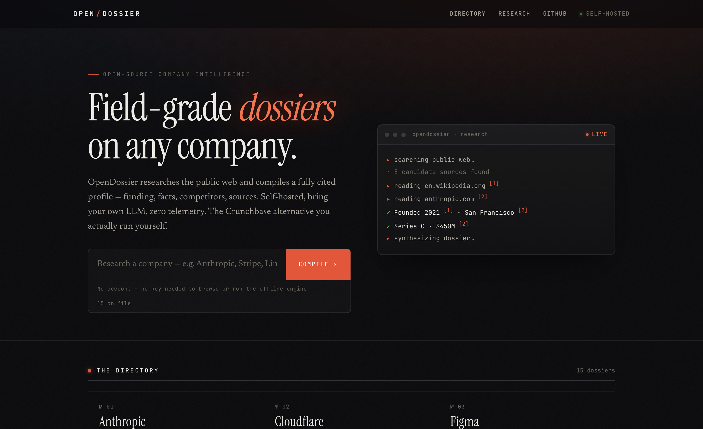
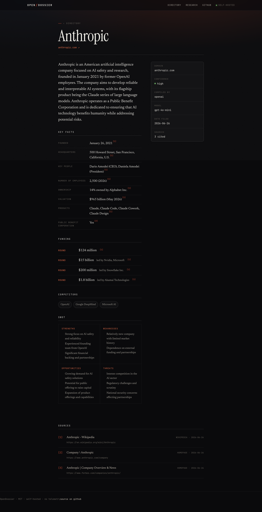

<div align="center">

# OpenDossier

### Build a sourced dossier on any company — self-hosted, bring your own LLM, no telemetry.

The open-source company-research tool you actually run yourself. Point it at a company name; it researches the public web and compiles a **cited** profile — summary, key facts, funding, competitors — that you own as plain files.

[](https://github.com/VladUZH/opendossier/actions/workflows/ci.yml)
[](LICENSE)
[](tsconfig.json)




</div>

## Why

Closed "AI company research" tools are appearing fast — a multi-agent system reads the web and hands you an instant company profile. They're useful, but they're hosted black boxes: you can't self-host them, you can't see or control their sources, you can't bring your own model to control cost, and your queries go to someone else's servers. When one such tool hit the Hacker News front page, the top comment asked *"do you plan to make it open source?"* — the maker declined, citing API costs.

**OpenDossier is the answer to that comment.** Bringing your own LLM key (or running a local model, or no model at all) dissolves the cost objection. Every claim is cited and dated, so you can judge it instead of trusting it. And the whole dataset is a folder of JSON files you can grep, diff, fork, and export — no rug-pull.

## What it does

- 🔎 **Research any company** → a structured, **source-cited** dossier (web UI *and* CLI).
- 🧾 **Every fact carries a citation** to a numbered source, with the fetch date. Provenance (which engine produced it) and a confidence level are shown, not hidden.
- 🔌 **LLM-agnostic.** Anthropic (Claude), OpenAI, a local **Ollama** model, or a **zero-key heuristic** engine — same interface, your choice, swappable with one env var.
- 🆓 **Works with no API key at all.** The default heuristic engine pattern-matches real fetched sources, so a fresh clone is genuinely useful before you paste any key.
- 📁 **Your data is a folder of files.** Dossiers live in `data/companies/<slug>.json` — greppable, diffable, forkable, trivially exportable. No database to stand up, no lock-in.
- 🙈 **No telemetry.** It calls the web sources and the LLM *you* configured. Nothing else.
- 🏠 **Self-hostable by construction.** It's a Next.js app plus a file corpus. `npm install && npm run dev`.

## 30-second quickstart

```bash
git clone https://github.com/VladUZH/opendossier
cd opendossier
npm install
npm run dev
# → open http://localhost:3000
```

That's it — **no API key, no config, no database.** Browse the seeded directory of 15 companies, or type a new company into the search box and watch it research live.

Prefer Docker?

```bash
docker compose up        # → http://localhost:3000
```

Your dossiers persist on the host in `./data` and stay human-readable. Add an LLM by dropping a key into `.env.local` (see below) — Compose picks it up automatically.

Prefer the terminal?

```bash
npm run research -- "Anthropic"          # compile a dossier to stdout
npm run research -- "Stripe" --save      # …and save it into the corpus
npm run research -- "Linear" --json      # machine-readable output
```

```
🔎 Researching "Anthropic" (provider: heuristic)
  · searching the web…
  · found 8 candidate source(s)
  · reading en.wikipedia.org…
  · reading www.anthropic.com…
  · synthesizing dossier…

Anthropic  (anthropic.com)

Anthropic is an AI safety and research company working to build reliable,
interpretable, and steerable AI systems.

Facts
  • Founded: 2021 [1]
  • Headquarters: San Francisco, California [1]

Sources
  [1] Anthropic — Wikipedia — https://en.wikipedia.org/wiki/Anthropic (2026-06-27)
  ...

Generated by heuristic · confidence: low · 2026-06-27
```

### Upgrade to an LLM (optional)

The heuristic engine is honest but shallow. For richer dossiers (funding rounds, competitors, fuller facts), point OpenDossier at a model — **bring your own key**:

```bash
cp .env.example .env.local
```

```ini
# .env.local — pick ONE
LLM_PROVIDER=anthropic                 # or openai | ollama | heuristic (default)
ANTHROPIC_API_KEY=sk-ant-...
# ANTHROPIC_MODEL=claude-opus-4-8      # set claude-haiku-4-5 to cut cost
```

Running a local model? `LLM_PROVIDER=ollama` needs no key at all. Your key and your data never leave your machine.

## How it works

```
   company name
        │
        ▼
┌──────────────────┐   ┌────────────────────┐   ┌─────────────────────┐
│  Gather sources  │──▶│   Synthesize       │──▶│  Cited dossier      │
│  DuckDuckGo +    │   │   heuristic / LLM  │   │  facts → sources[]  │
│  Wikipedia       │   │   (swappable)      │   │  + provenance/date  │
└──────────────────┘   └────────────────────┘   └─────────────────────┘
        no API key            your model, your cost        data/companies/*.json
```

Source-gathering, the LLM, and the file store are all behind small interfaces, so every part is swappable and the whole pipeline is deterministically unit-tested (no network, no keys in CI).



## How it compares

| | **OpenDossier** | Closed "AI company research" SaaS | Crunchbase |
|---|:---:|:---:|:---:|
| Open source (MIT) | ✅ | ❌ | ❌ |
| Self-hostable | ✅ | ❌ | ❌ |
| Run with **no API key** | ✅ (heuristic) | ❌ | ❌ |
| **Bring your own LLM** / model-agnostic | ✅ | ❌ | n/a |
| Local model (Ollama) | ✅ | ❌ | ❌ |
| Every claim **source-cited + dated** | ✅ | partial | partial |
| Data is **yours / exportable** (plain files) | ✅ | ❌ | ❌ |
| No telemetry | ✅ | ❌ | ❌ |
| Free | ✅ | ❌ | ❌ (paywalled) |

✅ = shipped in this repo today. See the roadmap for what's intentionally *not* built yet.

## Roadmap (not built yet)

These are deliberately out of scope for v1 — the core above is complete and works end-to-end. Contributions welcome.

- [ ] Scheduled re-runs / freshness refresh (re-research stale dossiers on a cron)
- [ ] Profile history & diffs (track how a company's dossier changes over time)
- [ ] Semantic search across the corpus (embeddings)
- [ ] More source connectors (news, filings, job boards) and per-source weighting
- [ ] Export to CSV / Markdown; a public read-only API + webhooks
- [ ] Optional multi-user / hosted mode with auth

## Configuration

All settings are environment variables (see [`.env.example`](.env.example)); **every one is optional**.

| Variable | Default | What it does |
|---|---|---|
| `LLM_PROVIDER` | `heuristic` | `heuristic` (no key) · `anthropic` · `openai` · `ollama` |
| `ANTHROPIC_API_KEY` / `ANTHROPIC_MODEL` | — / `claude-opus-4-8` | Claude key + model |
| `OPENAI_API_KEY` / `OPENAI_MODEL` | — / `gpt-4o-mini` | OpenAI key + model |
| `OLLAMA_BASE_URL` / `OLLAMA_MODEL` | `http://localhost:11434` / `llama3.1` | Local model |
| `SEARCH_PROVIDER` | `duckduckgo` | `duckduckgo` or `none` |
| `OPENDOSSIER_DATA_DIR` | `./data` | Where the corpus lives |

## Development

```bash
npm test          # vitest — 127 tests, deterministic, no network/keys
npm run typecheck # tsc --noEmit
npm run build     # production build
npm run seed      # (re)generate the seeded directory with the configured provider
```

The codebase is a small, framework-agnostic core (`src/core/`) — `schema`, `providers`, `search`, `research`, `store` — used by both the CLI (`src/cli/`) and the Next.js app (`app/`).

## License

[MIT](LICENSE). Stars are earned, not bought — if OpenDossier is useful to you, a star helps others find it. 🗂️
